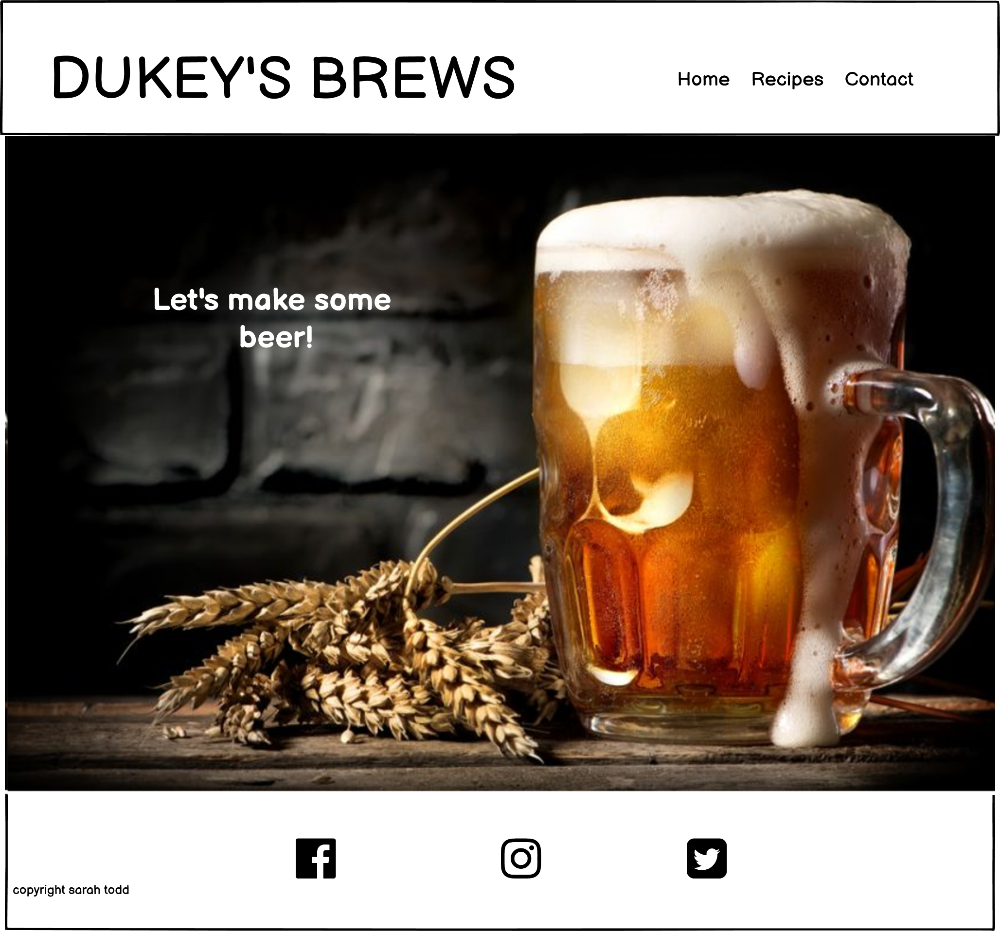

# DUKEY'S BREWS

 (pic of screens here)

[Dukeys Brews Live Site](https://0osaraho0.github.io/Dukeys/)

This website is aimed at home brewing enthusiasts.  The owner of the website wishes to share his recepies and home brewing ideas and have a space for other home brewing enthusiasts to be able to make contact and subscribe to his news letter.

# User Experience (UX)

before starting the website I sat down with the owner and discussed what he wanted to see from his website.

Site owners goals
- It needed to be easy to navigate
- It needed a contact or chatroom style section so that he could meet other beer enthusiasts.
- He wanted a section to show some of his recepies.
- He would like a blogging section so that in the future he could add to it when he next brews.

we rated these goals on a scale of 1 to 5 in importance and feesability

| Goal | Importance | Feesability |
|---| ---|----|
|Easy to navigate|5|5|
|Chatroom|2|2|
|Contact page|5|5|
|Recepies|5|5|
|Blogging|3|1|
|Gallery|1|5|

After looking at the feesability of the goals we decided to go ahead with making the website but to leave out the blogging page and the chat room section of the contact page for the initial update.  My skills as a developer are not quite at that stage yet and the owner does need to do that right away anyway.  The owner also does not have many pictures at this time so decided to leave the gallery for a later update as well.

With this in mind we decided to go for a front page with a link to his recepies and a contact page.

# Wireframes

Please see the initial wire frames for this site.

After going over the wireframes with the website owner we decided to go with beer glasses rather than bottles and a dark background with light writing.

### Colour Scheme

The owner wanted a mansculine feel the page and I felt the site needed a clean look to it. I have decided to go for a simple colour scheme of  #202020 and #fff8dc to facilitate this.

### Typography

I have used the fonts bebas Neue for my h1 as it is bold and eye catching and clean looking.
I have used Georama for the rest of the font because it also has a clean look and is easy to read.
I used Helvetica and Georgia for my back up fonts because they look similar.

### Imagery

The images used on the home and contact pages are inviting for thirsty beer enthusiasts that get excited over a refreshing pint of beer.  I used beer glasses on the recepie page rather than the bottles in the wireframes because they look more homely and inviting than the bottles.

The recipes have a white boarder arround them to give them a nice finish that matches the edge of the pictures. both picutes and recepies have a 10px radius to give nice rounded corners.

# Features

## Existing Features

- The header is visible on every page and has a consistant design throughout.
- The menu bar is is available at the top of every page, this gives the user ease of navigation when moving to different pages on the site.
- The tagline "Lets Brew.. Some Beer" informs the user the site is about brewing beer and takes you straight to the recipe page when clicked.  This promotes ease of use for site navigation.
- The hero image is of a pint of beer also gives the user information that the site is about beer brewing and looks inviting to beer drinkers
- The footer has social media links so that the user can link to the owners social media sites where then can find more up to date information from the owner and comment and connect with other beer enthusiasts through social media.  These are visible as you scroll up and down the page so they are easy to find.
- The recipe page has a hover function so the user can place the curser over the image of the beer and the recipe pops up over the top. This is fun inviting imagry and also makes the recipe for each beer easy to find. Each picture also has the name of the beer underneeth is so they are easy to find.
- The contact page allows enquires to be sent straight to the site owner. 
- radio buttons on the form allow the user to say yes or no to the newsletter.  I have used radio buttons rather than a tick box so that it is obvious they do not want the newsletter rather than possibly neglecting to tick the box.  This promotes better UX because it is then clear what he needs of the user are.

### Features left to impliment

- A gallery page of photos.  Once the owner has a sufficent number of photos he likes a new page can be added and the navigation bar updated.
- a comments section.  The owner would at some point like a comments section where beer enthusiasts and himself could talk with each other straight onto the site.  This coud be added to the contact page underneath the form and the navigation bar could be updated as well to show this.

# references

I used w3 schools to help with fixing my footer. https://www.w3schools.com/howto/howto_css_fixed_footer.asp

